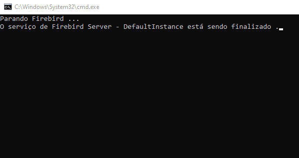
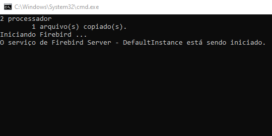
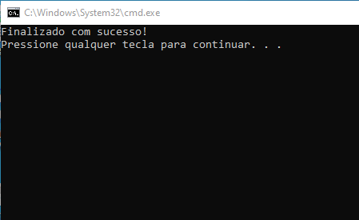

# Config Firebird

Projeto desenvolvido para automatizar um processo manual de otimização do serviço Firebird, no qual é necessário ajustar um valor no arquivo de configurações de acordo com a quantidade de processadores presentes na máquina.

O script solicita elevação de privilégios automaticamente, detecta instalações do Firebird x64 e x84, a quantidade de processadores e ajusta a configuração de acordo, de maneira simples e rápida, sendo ideal para ambientes de instalação remota e assistência.

## Script `Batch`

Para utilizar, basta executa o script `Config Firebird.bat`

<table>
    <tr>
        <td></td>
    </tr>
    <tr>
        <td></td>
    </tr>
    <tr>
        <td></td>
    </tr>
</table>